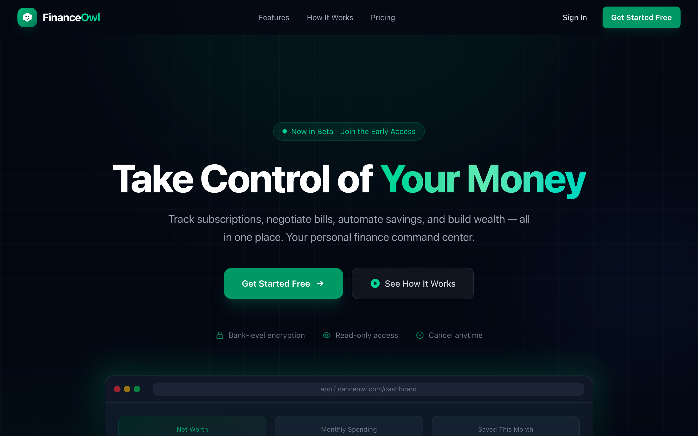

# Finance Owl

<p align="center">
  
</p>

Privacy-first, self-hosted personal finance manager.

Finance Owl gives you complete control over your financial data. Track accounts, transactions, budgets, investments, credit scores, and more -- all running on your own infrastructure with no data leaving your servers.

## Key Features

- **Bank sync** via Plaid -- automatically import transactions from 12,000+ institutions
- **Budgets and bill tracking** with smart alerts and anomaly detection
- **Investment portfolio** tracking with benchmarking
- **Credit monitoring** and score simulation
- **AI-powered insights** using local Ollama models (optional, fully offline)
- **Multi-household support** with advisor sharing
- **Retirement and debt-payoff planners**
- **Tax preparation** helpers and data export
- **Mobile app companion** (iOS/Android)
- **End-to-end encryption** for sensitive fields; WebAuthn/passkey and TOTP 2FA

## Tech Stack

| Layer | Technology |
|-------|-----------|
| Backend | NestJS 11, Drizzle ORM, PostgreSQL 16, Redis 7, BullMQ |
| Frontend | SvelteKit 2, Svelte 5, TailwindCSS 4, Chart.js |
| Mobile | Expo 52, React Native 0.76, Zustand |
| Shared | Zod validation schemas, TypeScript |
| AI (optional) | Ollama (local LLM), ChromaDB (vector store) |
| Integrations | Plaid (banking), Stripe (billing), Sentry (monitoring) |
| Infrastructure | Caddy (reverse proxy/TLS), Docker Compose |
| Monorepo | pnpm workspaces, Turborepo |

## Quick Start

### Prerequisites

- [Node.js](https://nodejs.org/) >= 20
- [pnpm](https://pnpm.io/) 9
- [Docker](https://www.docker.com/) and Docker Compose

### Local Development

```bash
# Clone the repository
git clone https://github.com/gr8monk3ys/finance-owl.git
cd finance-owl

# Install dependencies
pnpm install

# Start infrastructure (Postgres, Redis)
docker compose up -d postgres redis

# Set up environment variables
cp packages/backend/.env.example packages/backend/.env
cp packages/frontend/.env.example packages/frontend/.env
cp packages/mobile/.env.example packages/mobile/.env
# Edit .env with your secrets (JWT_SECRET, ENCRYPTION_KEY, etc.)

# Run database migrations and seed
pnpm --filter @finance-owl/backend db:migrate
pnpm --filter @finance-owl/backend db:seed

# Start all packages in dev mode
pnpm dev
```

The frontend runs at `http://localhost:3000` and the backend API at `http://localhost:4000`.

### Production with Docker Compose

```bash
# Configure environment
cp .env.example .env
# Set JWT_SECRET, JWT_REFRESH_SECRET, ENCRYPTION_KEY, PLAID_CLIENT_ID, PLAID_SECRET

docker compose up -d
```

Caddy handles TLS automatically. Set the `DOMAIN` environment variable for your hostname.

## Project Structure

```
finance-owl/
  packages/
    backend/       # NestJS API server (60+ modules)
    frontend/      # SvelteKit web application
    mobile/        # Expo / React Native mobile app
    shared/        # Zod schemas and constants shared across packages
    watch/         # Apple Watch package / experiments
  docker/          # Dockerfiles, Caddyfile, Redis config
  .github/         # CI/CD workflows (GitHub Actions)
  docker-compose.yml
  turbo.json
```

## Available Scripts

Run from the repository root:

| Command | Description |
|---------|-------------|
| `pnpm dev` | Start all packages in watch mode |
| `pnpm launch:check` | Audit launch prerequisites, public assets, envs, and release blockers |
| `pnpm launch:verify` | Run the launch audit plus code-level verification commands |
| `pnpm build` | Build all packages |
| `pnpm lint` | Lint all packages |
| `pnpm typecheck` | Type-check all packages |
| `pnpm test` | Run unit tests |
| `pnpm test:integration` | Run integration tests |
| `pnpm test:e2e` | Run end-to-end tests |
| `pnpm format` | Format code with Prettier |
| `pnpm format:check` | Check formatting |

Backend-specific (run with `pnpm --filter @finance-owl/backend`):

| Command | Description |
|---------|-------------|
| `db:generate` | Generate Drizzle migration files |
| `db:migrate` | Push schema to database |
| `db:studio` | Open Drizzle Studio GUI |
| `db:seed` | Seed the database |
| `db:backup` | Back up the database |
| `db:restore` | Restore a database backup |
| `db:reset` | Reset the database |

## Documentation

- [Architecture Overview](ARCHITECTURE.md)
- [Contributing Guide](CONTRIBUTING.md)
- [Security Policy](SECURITY.md)
- [Launch Readiness Guide](docs/launch-readiness.md)
- [App Store Metadata Template](docs/app-store-metadata.md)
- [Backend README](packages/backend/README.md)
- [Frontend README](packages/frontend/README.md)

## License

This project is licensed under the [GNU General Public License v3.0](LICENSE).
